# 词典笔任意姿态扫描项目案例

## 项目概览

项目面向词典笔任意姿态扫描能力，重点展示训练数据合成与位姿真值构建方法。公开版本仅说明算法思路和项目价值，不包含生产实现。

## 可视化结果

### 单行点云图

点云图用于展示扫描轨迹、姿态覆盖和位姿求解质量。点云底图只用于标定与矫正，不作为模型训练图像。

| 示例 1 | 示例 2 | 示例 3 | 示例 4 |
| --- | --- | --- | --- |
| 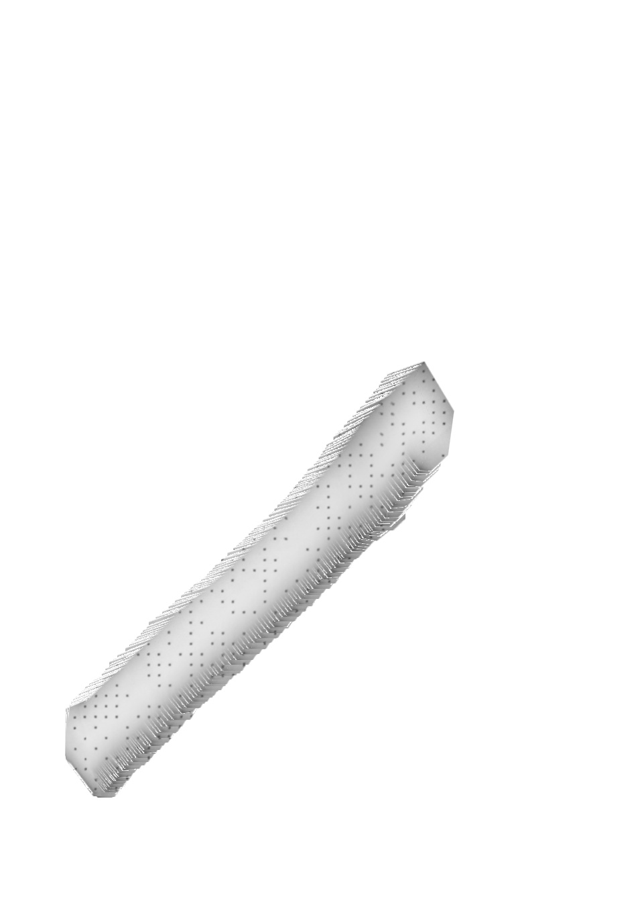 | 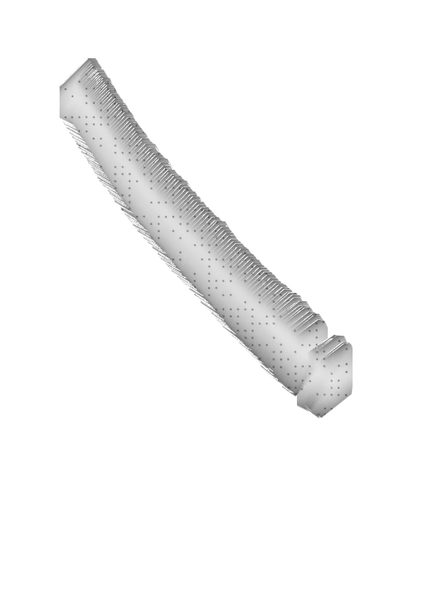 | 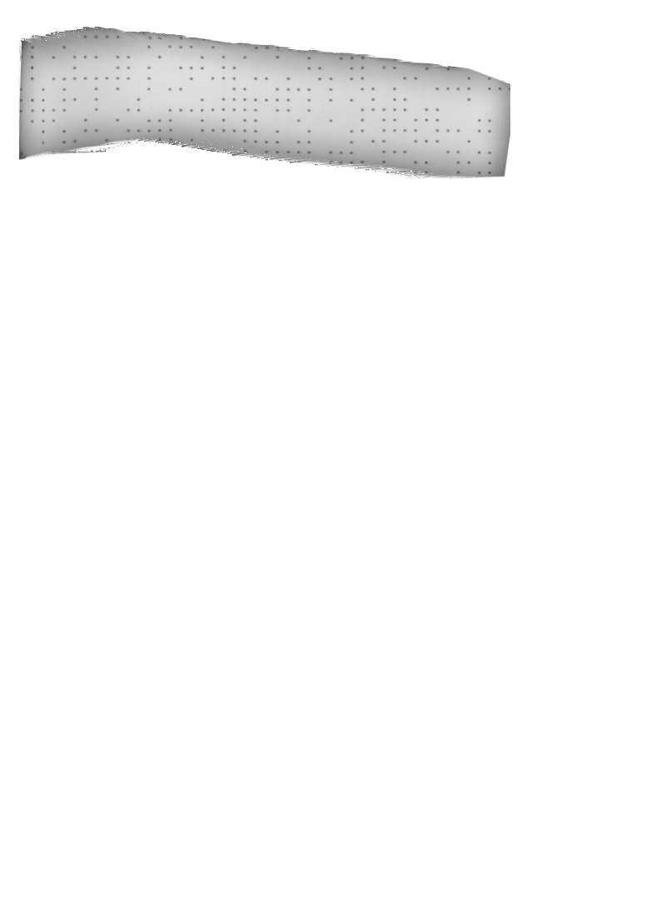 | 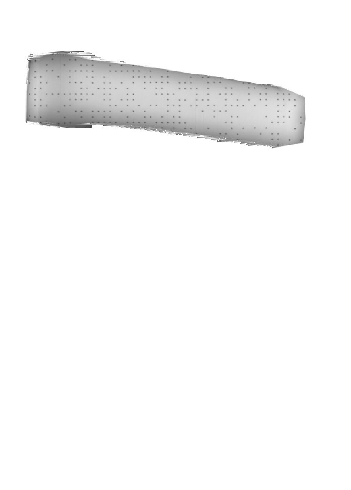 |

### 单行合成图

单行合成图展示基于点云位姿反推相机视角后的训练图像效果。

| 单行重建示例 |
| --- |
|  |

### 多行合成图与 ROI

多行图用于展示整页 / 多行扫描合成效果；ROI 图用于展示两行之间的有效交集区域和可用于训练的覆盖范围。

| 合成结果 | ROI / 重叠区域 |
| --- | --- |
| 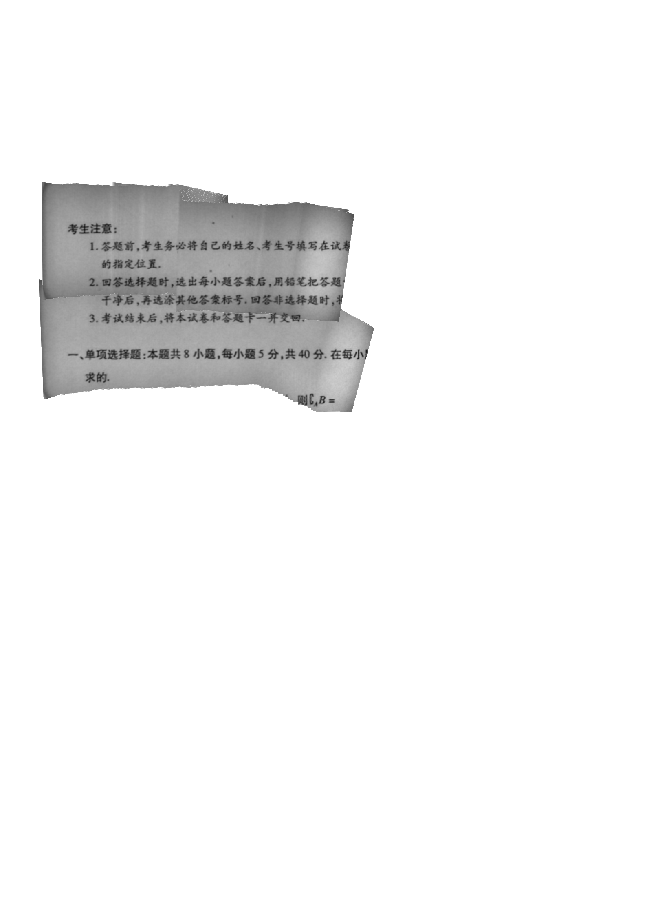 | 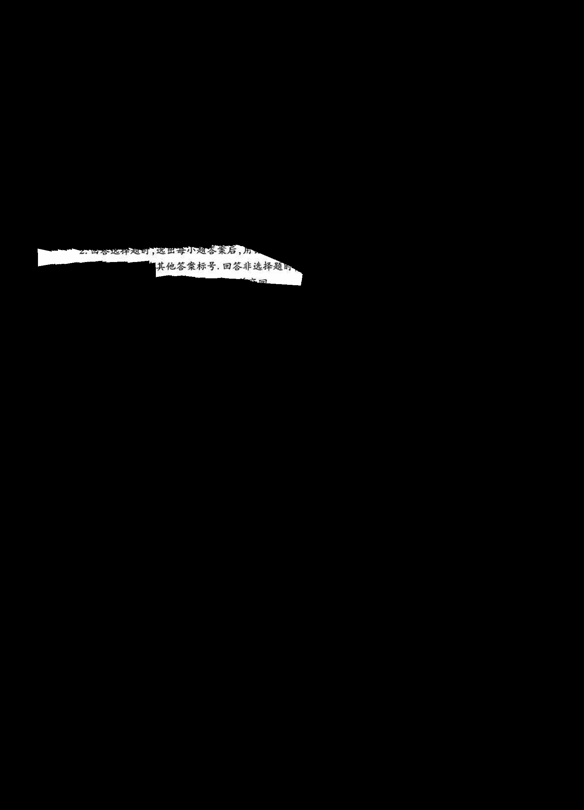 |
| 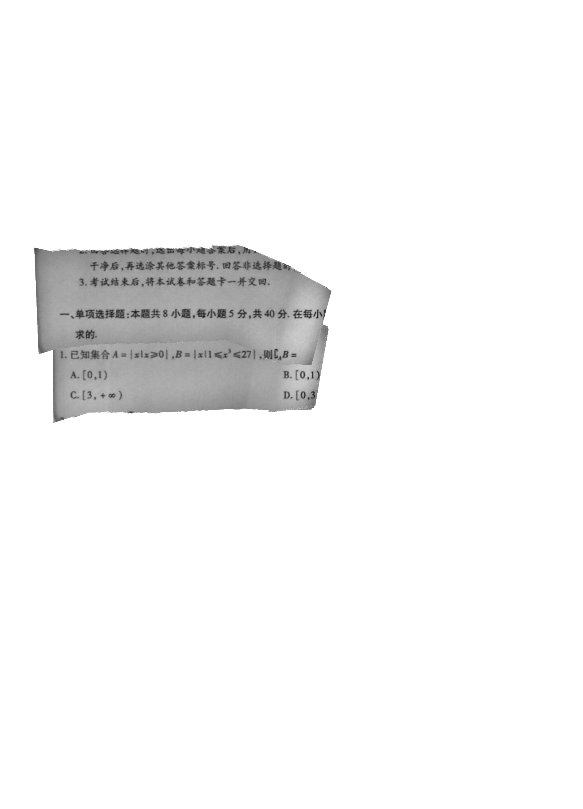 | 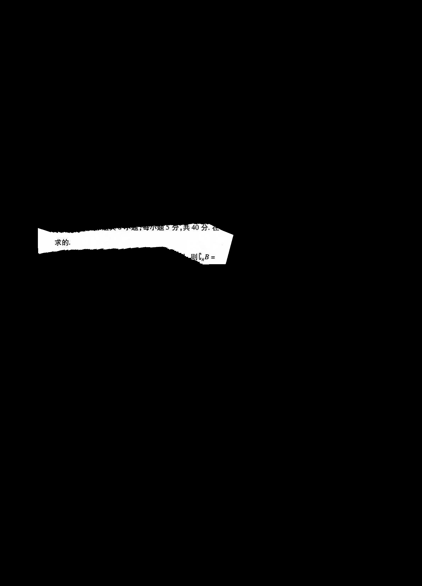 |
| 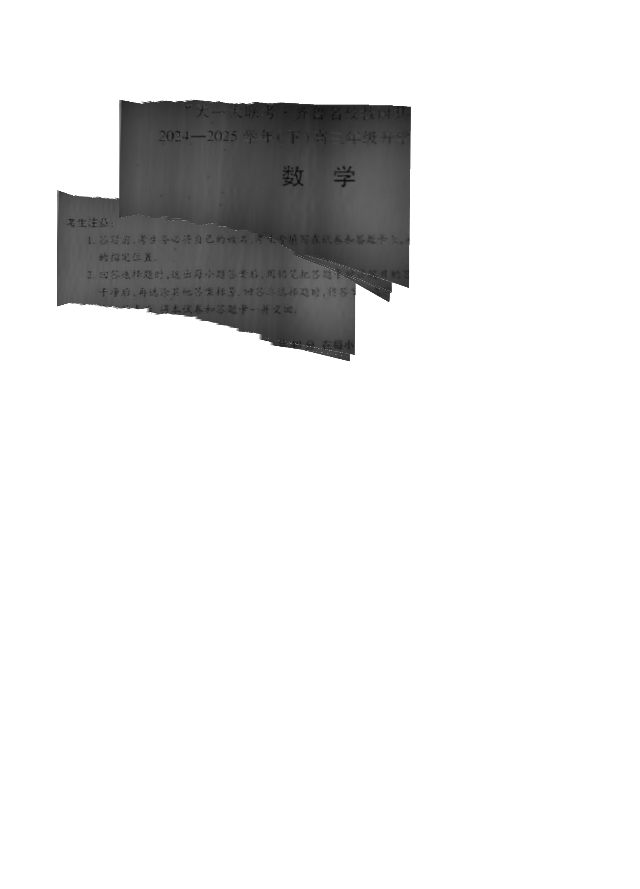 | 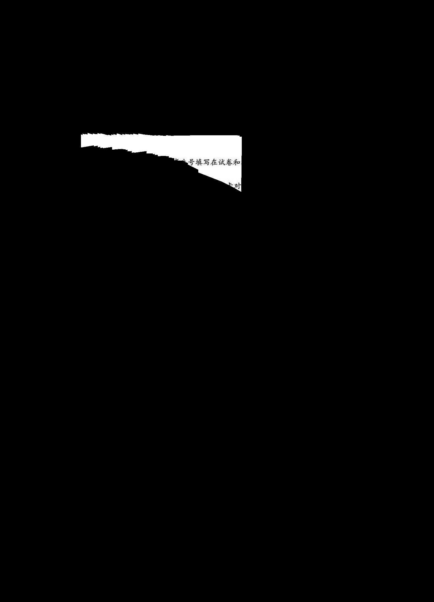 |
| 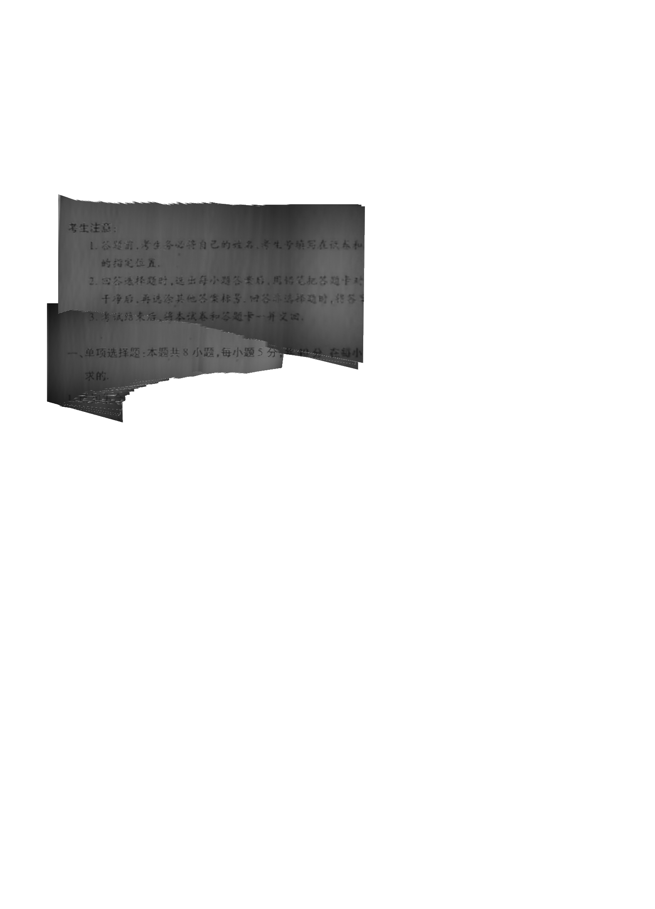 | 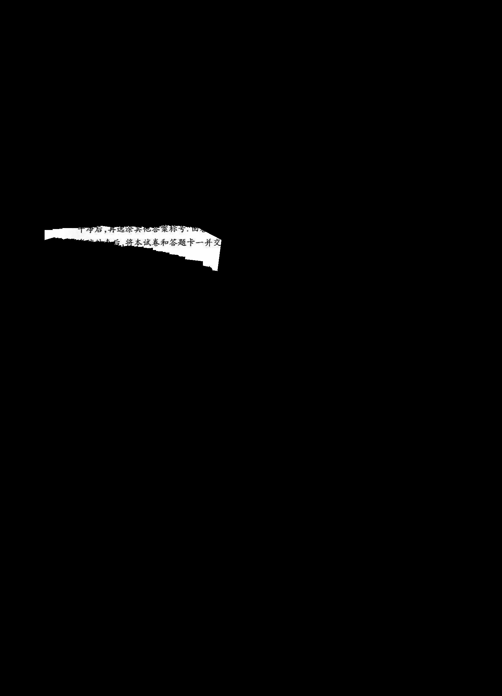 |

## 项目在做什么

系统需要让词典笔在不同角度、不同方向和非平面纸面上仍能拼出连续、清晰的扫描轨迹。由于真实扫描无法穷举姿态，也无法获得逐帧精确位姿标签，因此项目采用“点云配准求真值 + 逆向重建训练图”的合成数据方法。

## 遇到的困难

1. 真实采集无法同时覆盖 `0°–90°` 姿态、复杂轨迹和纸面起伏。
2. 连续位姿标签无法靠人工标注获得，单帧误差还可能污染整条轨迹监督。
3. 初版数据在相交区域单行、几何图和表格场景上存在弱项。

## 解决方案

1. 以点阵标定底图为像素级参考，使用 Sobel 梯度、模板匹配和 SVD 刚体配准求解全局绝对位姿。
2. 根据页面内容与逐帧位姿做复合逆变换，重建相机视角下的训练帧，再叠加纹理、光照和反光退化。
3. 设计不良帧率质量指标自动筛选轨迹，并用 PaddleOCR 定位几何图 / 表格区域，定向生成难例。

## 结果与验证

- 约 75 万条带真值位姿样本；
- 单行扫描数据约 14.3 万条高质量轨迹；
- 整页数据覆盖约 14.4 万条 `new_parallel` 与约 46.8 万条 `two_lines` 样本；
- 项目获网易 2025 年度公司级技术奖。

## 业务价值

该数据链路把真实采集无法覆盖的姿态空间转化为可控、可筛选、可迭代的训练数据空间，降低了对大规模人工采集和不可得位姿标签的依赖，并形成了“评测发现弱项—定向造数—复训验证”的数据闭环。

## 闭环总结

姿态空间过大 → 用点云配准构造位姿真值 → 逆向重建训练帧 → 质量筛选 → 评测定位弱项 → 定向补充难例 → 复训验证。

## 可视化图说明

`assets/可视化图/` 按展示目的拆分为三个子目录：

- `01_单行点云图/`：点云位姿数据的轨迹 / 姿态渲染可视化，用于展示位姿估计和轨迹覆盖情况。
- `02_单行合成图/`：单行合成 / 重建示例，包括基于点云位姿合成的单行图，用于展示逆向重建效果。
- `03_多行合成图/`：多行合成结果及 ROI / 重叠区域掩码，用于展示多行拼接和有效区域。

以上图片已按公开作品集展示口径编号整理，仅用于说明算法流程和效果边界，不包含原始数据路径、标定文件或 `.npy` 数据。

## 证据与假设
- **事实：**当前已整理脱敏效果图，用于支撑作品集展示。
- **公开边界：**仓库只展示项目思路、伪代码和脱敏可视化结果，不发布内部源代码、模型权重、数据路径或原始训练数据。
